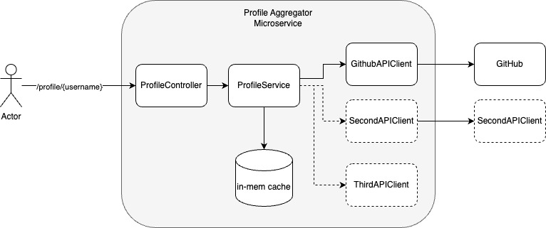

# Spring Boot Profile Aggregator
This application is a Spring Boot REST microservice that queries and aggregates user profile data from external services (currently Github).
It exposes a `/profile/{username}` API endpoint that fetches, transforms, and caches profile data.

Its purpose is to demonstrate sensible, modern software architecture decisions, while remaining open to future extension.

Above all, it applies my one-and-only engineering dogma: When in doubt, **keep it simple stupid**.

## Key Features
- Fetches Github user profile data and repositories
- Aggregates and formats the response as JSON
- Uses in-memory caching to address API rate limit issues
- Designed for simplicity, maintanability, and future extension.

## Example Response

Calling `/profile/octocat` returns:


```json
{
    user_name: "octocat",
    display_name: "The Octocat",
    avatar: "https://avatars3.githubusercontent.com/u/583231?v=4", 
    geo_location: "San Francisco",
    email: null,
    url: "https://github.com/octocat ", //<--trailing space included
    created_at: "2011-01-25 18:44:36", //<-- string w/o timezone in yyyy-MM-dd HH:mm:ss>
    repos: [{
        name: "boysenberry-repo-1",
        url: "https://github.com/octocat/boysenberry-repo-1" 
        }, //...
    ] 
}
```

The data is aggregated after calling two separate APIs:
- `https://api.github.com/users/octocat`
- `https://api.github.com/users/octocat/repos`
    - the `repos` endpoint only returns 30 requests by default. 


## Installation and Setup

1. Clone the repository
```
git clone https://github.com/rapomerantz/java-profile-aggregator.git
cd java-profile-aggregator
```
1. Build the project
```
./mvnw clean install 
```
1. Run the application
```
./mvnw spring-boot:run
```
By default, the service runs on `http://localhost:8080`

## API Usage
### Fetch a Github Profile
```
curl -X GET "http://localhost:8080/profile/octocat"
```
- Expected response: Returns GitHub user details and repositories (example above)
- If a username is not provided (e.g. `/profile/`): returns `400` (bad request)
- If the user is not found: Returns `404` 
- If the request fails: returns `500` 

## Running Tests
1. Run unit tests
```
./mvnw test
```
1. Run integration tests (issue with `./mvnw verify`, so using failsafe for now)
```
./mvnw failsafe:integration-test
```

## Architecture Decisions
1. Overall service structure and components
    - A standard controller/service/data-layer was used to isolate business logic from API client connections, endpoint details, and data mapping.
    - A very simple in-memory cache was created using the `ConcurrentHashMap` data structure. In a real-world application, this would very likely be handled by another technology (e.g. Redis).
    - Because the Github API didn't require connection authorization, none was implemented. If it were required, it would have been handled in the `GithubAPIClient` class
1. Where to handle the mapping? 
    - A small amount of mapping was required to transform the Github response into the desired format. I made the decision to use Jackson `@JsonProperty` annotations in the models to do this. This allowed me to use `camelCase` variable names in my Java code, while still delivering the desired JSON keys. 
    - This decision also allowed me to seperate the concerns of key mapping away from the service layer (it's not really business logic, it's presentation logic). 
    - As a result, some amount of "spring magic" is happening in the background here, especially on the way out.
    - Alternatively, more verbose mapping could have been done in the service.
1. How best to instantiate the Github client?
    - I thought about using a more complex Factory Pattern to create API clients (perhaps providing the factory with connection details dynamically on instantiation instead of hard coding them).
    - I also considered having an abstract `ApiClient` class that had shared logic in it. This ended up feeling like more complexity than necessary for a simple project with one API cleint. 
    - However, if we know we were going to have dozens of different clients, one or both of these approaches may have been worthwhile. 
1. How much abstraction is necessary?
    - I thought about having a `UserProfile` base abstract class, with `GithubUserProfile` extending it. Again, this might be useful if the project were more complex, but I decided it wasn't necessary for now. 
    - This would have enabled me to return a more generic `UserProfile` object in the controller, instead of specifically hardcoding in a `GithubUserProfile`
    - Similarly, there could be an abstract ApiClient, perhaps dynamically instantiated with connection details. This would have made my service more flexible, but more complex. 


## Architecture Diagram 

